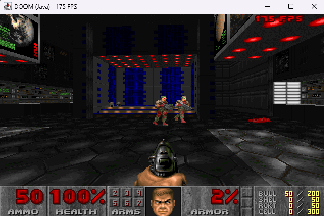

# java_doom



**Video:** [DOOM running in Java — at 180 FPS](https://youtu.be/EbLxJNpGXcE)

DOOM generic ported from Harbour to **Java 17+ CLI + SDL2** (JNA). Not a web app, not Android, not libGDX.

By **Wagner Nunes da Silva**

- [vagucs@bol.com.br](mailto:vagucs@bol.com.br)
- [vagucs@vagucs.com.br](mailto:vagucs@vagucs.com.br)
- [vagucs@gmail.com](mailto:vagucs@gmail.com)
- [www.vagucs.com.br](https://www.vagucs.com.br)

This tree is a port of **[harbour_doom](https://github.com/vagucs/harbour_doom)** (`doom_hb`): the same Chocolate Doom / doomgeneric engine that first went from C to Harbour, then to Python (`doom_python`), PHP (`php_doom`) and Node (`node_doom`), now from Harbour to Java.

Every source file carries the same author header as the Harbour `.prg` files.

Versão em português: [README.pt.md](README.pt.md)

---


## What this project is

The Chocolate Doom / doomgeneric engine was translated to **Harbour** (`.prg` / `.ch`) with a thin C layer for Allegro 4.2.2. That work lives at [github.com/vagucs/harbour_doom](https://github.com/vagucs/harbour_doom). This directory is the **same study piece again**, in Java:

- Window, keys, PCM: **SDL2** through **JNA** (no AWT canvas, no browser, no HTTP)
- Framebuffer: 320×200, 8-bit PLAYPAL, `int[]`, scaled in the window
- Game tick: 35 Hz (`TICRATE`), same as vanilla
- Renderer: BSP, visplanes, `R_DrawColumn` / `R_DrawSpan`, 16.16 `fixedMul` / `fixedDiv` (`long` intermediates)
- Map: VERTEXES, LINEDEFS, SIDEDEFS, SECTORS, SEGS, SSECTORS, NODES, THINGS, BLOCKMAP, REJECT
- Play: walk, doors, lifts, switches, teleporters, exit, pickups, weapons (including chainsaw raise/cut), status bar, Tab automap, DS* sound, MUS→MIDI music, ESC menu (options, load/save), intermission tally, melt wipe, bunny scroll, monster look/chase/attack

You need a legal IWAD (shareware `doom1.wad` or commercial `doom.wad` / `doom2.wad` / etc.). This repository does not ship commercial WAD data.

It is a **complete gameplay port** of the Harbour engine into Java (the same systems as the finished Node tree, including teleporters, extra cheats, `P_ChangeSector` platforms, and Screen Size via `-/+`). File count is condensed versus 100+ `.prg` files; behavior follows the Harbour sources.

Not in this tree (same cut as Harbour `boot.prg`):

- Network, CD music, joystick
- `-colors` palette quantize (Harbour-only experiment)
- Demo playback, full vanilla `info` state tables

---


## Educational purpose

This project is, above all, a **study piece**. DOOM (1993) is small enough to read end to end and dense enough to teach real engine work: BSP rendering, 16.16 fixed-point, a tic-based loop, a WAD file system.

The Harbour port taught how to read C in another language. Python dropped the preprocessor and 1-based arrays. PHP and Node made the native boundary **FFI / koffi to SDL2**. This Java port keeps that idea and adds one more lesson: `int` **is already a 32-bit two's complement word**, like C. Wrap-around, `>>` / `>>>`, and 16.16 multiply with a `long` middle step map almost 1:1 — no PHP `intdiv()` trap, no JavaScript `BigInt` for `FixedMul`.

The other side of that coin: a product that PHP and Node keep as a wide integer **wraps in Java** if you write it as `int * int`. `Collision.pointOnSide` (BSP child pick) must use `long`, or the map draws in the wrong place and a few steps feel like a wall. That is the same overflow the C engine handled with `FixedMul`.

What it is meant to teach:

- **Six languages, one engine.** C (`base_c/` in harbour_doom) → Harbour (`.prg`) → Python (`doom_python`) → PHP (`php_doom/src`) → TypeScript (`node_doom/src`) → Java (`java_doom/src/doom`). Same names (`P_Thrust`, `R_DrawColumn`, `A_Look`) so you can open the versions side by side.
- **What pointers were doing.** Java uses objects and arrays; BAM angles and 16.16 stay explicit (`Compat.asU32`, `shar`, `fixedMul`) so the original overflow rules stay visible.
- **Where a VM is enough.** The whole game runs in the JVM. SDL2 is only the window, input, and PCM queue. JNA is the native boundary, like Allegro was in Harbour and FFI/koffi in PHP/Node.
- **CLI, not a servlet.** There is no browser canvas and no application server.
- **Legacy modernization.** Keep behavior identical, isolate the native layer, verify against the original.

Suggested way to study:

1. Run it, then read `Doom.java` and `Game.java` — boot, tic, input.
2. Compare `Compat.java` with Harbour `xhb_compat.prg` / `m_fixed.prg`, PHP `Compat.php`, and Node `src/compat.ts`.
3. Open `Renderer.java` next to `r_main.prg` / `r_bsp.prg` / `r_segs.prg` / `r_draw.prg`.
4. Follow a door from **Space** through `Specials.java`.
5. Follow a shot from **Ctrl** in `Player.java` to `Collision.lineAttack` and `Enemy`.
6. Read `Collision.pointOnSide` — `long` vs `int` on the BSP product.

---


## From C / Harbour / Python / PHP / Node to Java

Java arrays are 0-based, like C, Python, PHP and Node. Harbour arrays were 1-based; that offset is gone here.

The table below is the same comparison as the Node port, with one extra column for Java:


| DOOM in C                   | Harbour                 | Python                    | PHP                             | Node                             | Java                             |
| --------------------------- | ----------------------- | ------------------------- | ------------------------------- | -------------------------------- | -------------------------------- |
| `struct` / `typedef struct` | `CLASS ... DATA`        | `@dataclass`              | `class` + typed properties      | `class` + typed fields           | `class` + fields                 |
| `thing->x`                  | `thing:x`               | `thing.x`                 | `$thing->x`                     | `thing.x`                        | `thing.x`                        |
| `NULL`                      | `NIL`                   | `None`                    | `null`                          | `null`                           | `null`                           |
| `array[0]`                  | `array[1]`              | `array[0]`                | `$array[0]`                     | `array[0]`                       | `array[0]`                       |
| `&`, `|`, `^`               | `hb_qbitAnd/Or/Xor`     | `&`, `|`, `^`             | `&`, `|`, `^`                   | `&`, `|`, `^`                    | `&`, `|`, `^`                    |
| `x >> n` unsigned           | `UShr(x, n)`            | `ushr(x, n)`              | `Compat::ushr($x, $n)`          | `ushr(x, n)`                     | `Compat.ushr` / `>>>`            |
| `x >> n` signed             | `Shar(x, n)`            | `shar(x, n)`              | `Compat::shar($x, $n)`          | `shar(x, n)`                     | `Compat.shar` / `>>`             |
| 32-bit wrap                 | `AsU32` / `AsInt32`     | `as_u32` / `as_i32`       | `Compat::asU32` / `asI32`       | `asU32` / `asI32`                | `int` already wraps              |
| `fixed_t` 16.16             | `FixedMul` / `FixedDiv` | `fixed_mul` / `fixed_div` | `Compat::fixedMul` / `fixedDiv` | `fixedMul` / `fixedDiv` (BigInt) | `fixedMul` / `fixedDiv` (`long`) |
| `byte *` framebuffer        | Harbour string          | `bytearray` + numpy LUT   | `array<int>` + SDL ARGB8888     | `Uint8Array` + SDL ARGB8888      | `int[]` + SDL ARGB8888           |
| Allegro 4.2.2               | GTALLEG / llibg         | pygame                    | SDL2 via FFI                    | SDL2 via koffi                   | SDL2 via JNA                     |
| `Z_Malloc`                  | GC                      | GC                        | GC                              | GC                               | GC                               |
| `PUBLIC` globals            | `PUBLIC` / `MEMVAR`     | fields on `Game`          | public fields on `Game`         | public fields on `Game`          | public fields on `Game`          |
| 100+ `.prg` files           | 1:1 with C              | condensed `doom/*.py`     | condensed `src/*.php`           | condensed `src/*.ts`             | condensed `src/doom/*.java`      |


### Side-by-side: `P_Thrust`

C (`base_c/p_user.c` in harbour_doom):

```c
void P_Thrust (player_t* player, angle_t angle, fixed_t move)
{
    angle >>= ANGLETOFINESHIFT;
    player->mo->momx += FixedMul(move,finecosine[angle]);
    player->mo->momy += FixedMul(move,finesine[angle]);
}
```

Harbour (`p_user.prg`):

```harbour
PROCEDURE P_Thrust( player, angle, move )
    angle := UShr( angle, ANGLETOFINESHIFT )
    player:mo:momx += FixedMul( move, finecosine[ angle + 1 ] )
    player:mo:momy += FixedMul( move, finesine[ angle + 1 ] )
RETURN
```

Python (`doom/player.py`):

```python
def thrust(mo, angle, move):
    mo.momx += fixed_mul(move, fine_cos(angle))
    mo.momy += fixed_mul(move, fine_sin(angle))
```

PHP (`src/Player.php`):

```php
public static function thrust(Mobj $mo, int $angle, int $move): void
{
    $mo->momx += Compat::fixedMul($move, Tables::fineCos($angle));
    $mo->momy += Compat::fixedMul($move, Tables::fineSin($angle));
}
```

TypeScript (`src/player.ts`):

```typescript
static thrust(mo: Mobj, angle: number, move: number): void {
  mo.momx += fixedMul(move, fineCos(angle));
  mo.momy += fixedMul(move, fineSin(angle));
}
```

Java (`src/doom/Player.java`):

```java
public static void thrust(Mobj mo, int angle, int move)
{
    mo.momx += Compat.fixedMul(move, Tables.fineCos(angle));
    mo.momy += Compat.fixedMul(move, Tables.fineSin(angle));
}
```

`->` becomes `.`. Unsigned angle indexing lives in `Tables.fineCos`. The Harbour `+ 1` index offset is gone. `fixedMul` uses `long` so the 16.16 product matches vanilla.

---


## What remains native, and why

Java is **the game engine**. Native code stays only where the JVM cannot talk to the OS window or the mixer.


| Piece          | Native API         | Why                                                                                                   |
| -------------- | ------------------ | ----------------------------------------------------------------------------------------------------- |
| `Video.java`   | SDL2 via **JNA**   | Window, keyboard, ARGB8888 blit, PCM queue. Same role as Allegro in Harbour and FFI/koffi in PHP/Node |
| `Sound.java`   | `javax.sound.midi` | MUS→MIDI playback (`Mus2Mid.java` is still Java). No winmm MCI                                        |
| `lib/SDL2.dll` | SDL2 64-bit        | Drop-in library; set `SDL2_PATH` to override                                                          |


The engine itself is ordinary Java. `javac` produces class files in `out/`.

---


## Technology


| Layer              | This port                                | Harbour (`harbour_doom`)       |
| ------------------ | ---------------------------------------- | ------------------------------ |
| Language           | Java 17+ (tested on Temurin 17.0.19)     | Harbour / xHarbour             |
| Window, keys, PCM  | SDL2 (JNA 5.17)                          | Allegro 4.2.2 + GTALLEG        |
| Palette blit / CRT | Java loop → `SDL_UpdateTexture` ARGB8888 | C in `doomgeneric_allegro.prg` |
| MIDI               | Java Sound `Sequencer`                   | Allegro MIDI / MCI             |
| IWAD               | same WAD lumps                           | same                           |
| Build              | `javac` + `java` (or `run.bat`)          | `compile.bat` / `hbmk2`        |


Required JDK:

```
java -version    # 17+
javac -version   # 17+
```

SDL2: drop **SDL2.dll** (64-bit) in `lib/` on Windows, or set `SDL2_PATH`. The PHP port's `php_doom/lib/SDL2.dll` (or `node_doom/lib/SDL2.dll`) can be copied here. See `lib/README.txt`.

JNA: `lib/jna-5.17.0.jar`. `run.bat` downloads it from Maven Central if the file is missing.

---


## Performance

Typical blit rate on the same PC (320×200, windowed, shareware IWAD). The game still ticks at 35 Hz (`TICRATE`); `-fps` shows the blit rate. Java creates the SDL renderer with `SDL_RENDERER_PRESENTVSYNC`, so the number locks to the display refresh (here **~180**, locked).

The same comparison as the Node port, plus Java: Harbour is an interpreter in front of Allegro, Python and PHP walk bytecode every column, Node is a JIT with `BigInt` on every `fixedMul`, Java is HotSpot plus primitive `int` / `long`. That is why this tree sits above Node on the same machine.


| Port                   | Typical FPS         |
| ---------------------- | ------------------- |
| Harbour (`doom_hb`)    | ~12                 |
| Python (`doom_python`) | ~8                  |
| PHP (`php_doom`)       | ~20                 |
| Node (`node_doom`)     | ~100                |
| Java (`java_doom`)     | ~180 (vsync-locked) |


---


## How to run

JDK 17+, SDL2 on the library path (or `java_doom/lib/SDL2.dll` on Windows). From this directory:

```
run.bat
run.bat -fps
run.bat -iwad ..\DOOM1.WAD -warp 1 1 -crt
```

Or by hand:

```
javac -encoding UTF-8 -cp lib\jna-5.17.0.jar -d out src\doom\*.java
java -cp out;lib\jna-5.17.0.jar doom.Doom -iwad ..\DOOM1.WAD
```

`run.bat` compiles if `out/` is missing, copies SDL2 from `php_doom/lib` or `node_doom/lib` when needed, downloads JNA if the jar is absent, and if you omit `-iwad` looks for `DOOM1.WAD` here or in the parent `doom_minimal` folder.

Linux: `sudo apt install libsdl2-2.0-0` then compile and run with `:` on the classpath.

macOS: `brew install sdl2` then compile and run.

With no `-iwad` it looks for a `.wad` argument, then `doom1.wad` / `DOOM1.WAD` / `doom.wad` / `doom2.wad` in the current directory, `DOOMWADDIR`, this folder, and the parent `doom_minimal` folder.

---


## Keys

Classic DOOM controls (this condensed port; not remapped via `default.cfg`).

### Movement and actions


| Key               | Action                                               |
| ----------------- | ---------------------------------------------------- |
| Arrow keys        | Forward, back, turn                                  |
| **Shift**         | Run                                                  |
| **Alt**           | Strafe (hold)                                        |
| **,** / **.**     | Strafe left / right                                  |
| **Ctrl**          | Fire (hold to repeat; weapon animation + `A_ReFire`) |
| **Space** / **E** | Use / open door                                      |
| **1**             | Fist / chainsaw (toggle)                             |
| **2**–**7**       | Pistol, shotgun, chaingun, rocket, plasma, BFG       |
| **Enter**         | Start from the title                                 |
| **Tab**           | Toggle automap                                       |


Movement is **arrow keys only** (no WASD), so letter keys stay free for cheat codes.

### Automap (while the map is open)


| Key           | Action                                                     |
| ------------- | ---------------------------------------------------------- |
| Arrow keys    | Pan the map                                                |
| **+** / **-** | Zoom                                                       |
| **0**         | Fit / max zoom                                             |
| **F**         | Follow the player                                          |
| **G**         | Grid                                                       |
| **M**         | Mark position                                              |
| **C**         | Clear marks                                                |
| **Tab**       | Close the map                                              |
| **IDDT**      | Cheat: all walls, then things (type while the map is open) |


### Menu and function keys


| Key           | Action                                                   |
| ------------- | -------------------------------------------------------- |
| **Esc**       | Menu                                                     |
| **Enter**     | Confirm / go forward                                     |
| **Backspace** | Back                                                     |
| **Y** / **N** | Yes / No                                                 |
| **F2**        | Save                                                     |
| **F3**        | Load                                                     |
| **F11**       | Toggle FPS overlay                                       |
| **+** / **-** | Screen Size (same as Options) when the automap is closed |
| **Alt+Enter** | Toggle full-screen                                       |


Options **Screen Size** and **Graphic Detail** (HIGH/LOW) change the 3D view (`R_SetViewSize`), not the window scale. Window scale: drag the window or Alt+Enter.

### Cheats (nostalgia only)

Type these on the keyboard during play; no Enter needed:


| Code                        | Effect                                                             |
| --------------------------- | ------------------------------------------------------------------ |
| **IDDQD**                   | God mode (*Degreelessness Mode*); HUD face `STFGOD0`               |
| **IDKFA**                   | All weapons, ammo, keys, and armor                                 |
| **IDFA**                    | Weapons, ammo, and armor (no keys)                                 |
| **IDCLIP** / **IDSPISPOPD** | No clipping                                                        |
| **IDDT**                    | Automap cheat (type while the map is open): all walls, then things |


---


## Command-line parameters


### IWAD


| Parameter        | Description                     |
| ---------------- | ------------------------------- |
| `-iwad file.wad` | IWAD to load (path or filename) |
| `file.wad`       | Same thing, without `-iwad`     |


### Video


| Parameter     | Description                                                                            |
| ------------- | -------------------------------------------------------------------------------------- |
| `-fullscreen` | Start in a fullscreen window                                                           |
| `-crt`        | Scanline-style CRT look (Harbour `-crt` family). Clearer at window scale 2× or more    |
| `-fps`        | Show frames per second on the HUD (top-right) and in the window title. **F11** toggles |


### Game


| Parameter     | Description                                      |
| ------------- | ------------------------------------------------ |
| `-warp e m`   | Skip the title and start episode `e` map `m`     |
| `-skill n`    | 0 baby … 4 nightmare (default 2, Hurt Me Plenty) |
| `-nomonsters` | Do not spawn enemies                             |


Harbour-only flags **not** implemented here: `-videoc`, `-scaling`, `-gfxmode`, `-colors`, `-nosound` / `-nosfx` / `-nomusic`, `-config`, net/CD/joystick.

---


## Layout

```
src/doom/Doom.java   entry: java doom.Doom
run.bat              Windows helper (javac + default IWAD)
src/doom/            engine (Java 17)
lib/                 JNA jar + drop SDL2.dll here
screenshot/doom.png  README screenshot
docs/                donation QR codes
```


| Path                | Vanilla / Harbour                                            |
| ------------------- | ------------------------------------------------------------ |
| `Compat.java`       | `m_fixed`, `xhb_compat`                                      |
| `Defs.java`         | `doomdef`, `doomtype`, `doomkeys` constants                  |
| `Bin.java`          | little-endian WAD / map readers                              |
| `Keys.java`         | `doomkeys` / SDL keycodes                                    |
| `Wad.java`          | `w_wad`                                                      |
| `Video.java`        | `i_video`, `doomgeneric_allegro` (SDL2 + `-crt`)             |
| `Sdl2.java`         | JNA bindings for SDL2                                        |
| `VVideo.java`       | `v_video`                                                    |
| `Tables.java`       | `tables`                                                     |
| `Resources.java`    | `r_data`                                                     |
| `Renderer.java`     | `r_main` `r_bsp` `r_segs` `r_plane` `r_draw`                 |
| `World.java`        | `p_setup`                                                    |
| `Collision.java`    | `p_map` `p_maputl` `p_sight` (REJECT)                        |
| `Player.java`       | `p_user` `p_pspr`                                            |
| `Specials.java`     | `p_spec` `p_doors` `p_plats` `p_floor` `p_switch` `p_telept` |
| `Mobj.java`         | `info` `p_inter`                                             |
| `Sprites.java`      | `r_things`                                                   |
| `Enemy.java`        | `p_enemy` (look / chase / attack)                            |
| `Status.java`       | `st_stuff`                                                   |
| `AmMap.java`        | `am_map`                                                     |
| `Sound.java`        | `i_sound`, CacheSFX, Java Sound MIDI                         |
| `Mus2Mid.java`      | `mus2mid.c`                                                  |
| `Menu.java`         | `m_menu`                                                     |
| `Saveg.java`        | `p_saveg` (24-byte name + JSON)                              |
| `Intermission.java` | `wi_stuff`                                                   |
| `Wipe.java`         | `f_wipe` melt                                                |
| `Finale.java`       | `f_finale` (text + bunny scroll)                             |
| `Game.java`         | `d_main` `g_game` `d_loop` `boot`                            |


---


## Lineage

1. **id Software DOOM** (1993) — original engine
2. **Chocolate Doom / doomgeneric** — portable C
3. **[harbour_doom](https://github.com/vagucs/harbour_doom)** — Harbour + Allegro 4.2.2 (`Doom_hb.exe`)
4. **doom_python** — Python + pygame, from that Harbour port
5. **php_doom** — PHP 8 CLI + SDL2 FFI
6. **node_doom** — Node.js CLI + TypeScript + SDL2 (koffi)
7. **This tree** — Java 17 CLI + SDL2 (JNA), sourced from the same Harbour gameplay (100% of gameplay intent from the `.prg` files; condensed file count)

---


## Donate


### Ethereum

`0x1b64038A2b1DB73ABd0068d8B9B0d1dC5a90C5F1`


### PIX

Key: `vagucs@bol.com.br`

